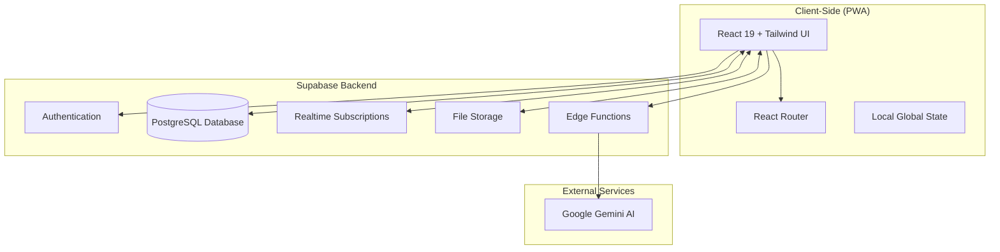

# NomadSync: Product Overview

## Executive Summary
**NomadSync** is your ultimate companion for group travel adventure. Gone are the days of chaotic spreadsheets and messy group chats. NomadSync creates a shared digital command center for your trip, keeping everyone aligned, on budget, and focused on the experience. Whether you're backpacking through Europe or road-tripping across the coast, NomadSync ensures smooth operations so you can enjoy the journey.

## System Architecture

## Core Pillars

### 1. The Itinerary Hub
The central nervous system of your trip.
- **Visual Timeline**: See your entire journey at a glance. Events flow logically from start to finish.
- **Interactive Maps**: Integrated maps show you exactly where you need to be.
- **Rich Details**: Store tickets, reservation numbers, and notes right where you need them.

### 2. Smart Expenses & Budgeting
Stop arguing about money and start enjoying the trip.
- **Expense Splitting**: Flexible split options handle complex scenarios effortlessly.
- **AI Receipt Scanning**: Snap a photo of a receipt, and let our AI (powered by Google Gemini) automatically extract the details and suggest splits.
- **Real-time Balances**: Know exactly who owes what at any moment. Settle up with confidence.

### 3. Field Operations (On the Go)
Built for the realities of travel.
- **Offline-First**: Access your itinerary and log expenses even without a signal. Changes sync when you're back online.
- **PWA Installation**: Install as a native-like app on your phone for quick access.
- **Performance**: Lightning-fast interaction tailored for mobile use.

### 4. Squad Management
Collaboration made simple.
- **Real-time Sync**: Updates from one person appear instantly for everyone else.
- **Roles & Permissions**:
    - **Lead**: Full control over trip settings and members.
    - **Editor**: Can add/edit itinerary items and expenses.
    - **Viewer**: Read-only access for family or friends following along.
