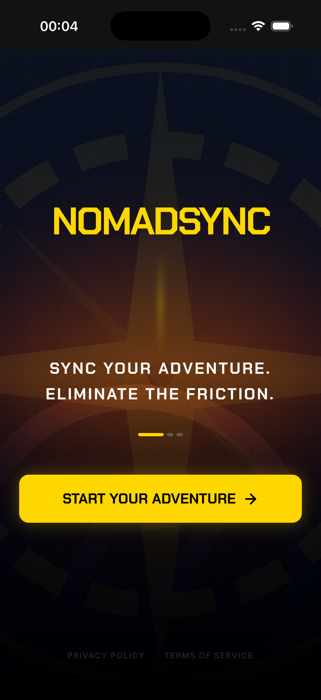
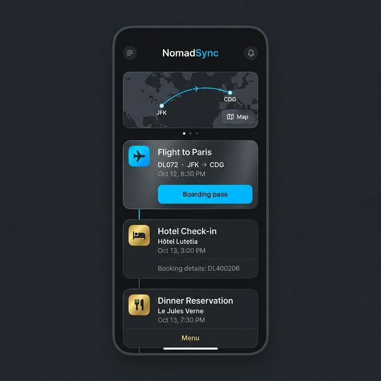
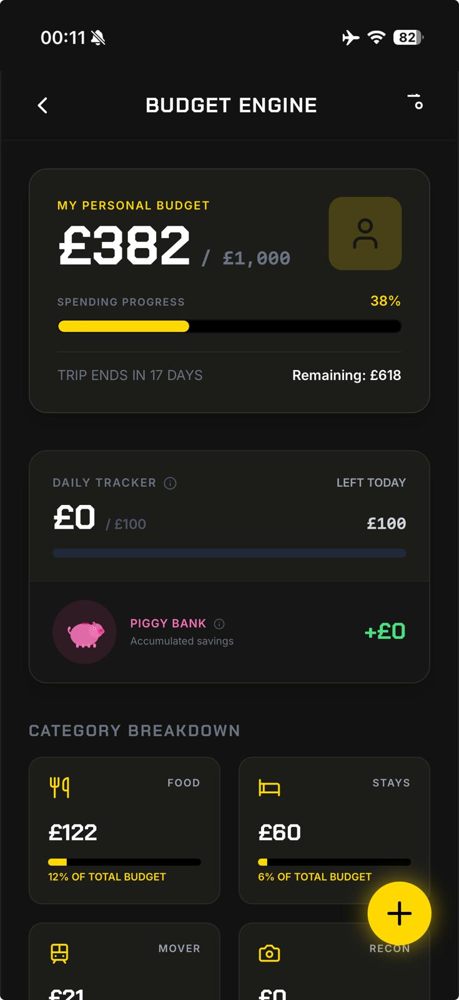

# NomadSync



Your ultimate companion for group travel adventure, creating a shared digital command center for your trip.

## What This Does

NomadSync replaces chaotic spreadsheets and messy group chats for group trips. Whether you're backpacking through Europe or road-tripping across the coast, it keeps everyone aligned and on budget. Features include a visual timeline, interactive maps, and smart expense splitting with AI-powered receipt scanning (via Google Gemini) to easily itemize costs. It also features multi-currency support with live exchange rate conversions, and push notifications for new trip invites and major itinerary updates. Best of all, it works offline first, so you can log expenses without a signal and sync up later.

## Screenshots

<div align="center">
  
  
</div>

## Demo

**Live App:** [https://www.nomadsync.co](https://www.nomadsync.co)

## Tech Stack

- **Frontend**: React 19, Ionic React, Tailwind CSS - For a responsive, native-like mobile PWA experience.
- **Backend**: Supabase (PostgreSQL, Auth, Edge Functions) - For real-time data sync, secure authentication, and scalable backend logic.
- **AI Integration**: Google Gemini & Groq (Llama) - For intelligent receipt scanning and automated expense itemization.
- **Local Storage**: Dexie.js (IndexedDB) - To enable robust offline-first functionality and queue operations.
- **Maps**: Leaflet & React-Leaflet - For interactive visual itineraries.

## Getting Started

```bash
# Clone the repository
git clone https://github.com/dromerosalem/NomadSync.git

# Navigate into the directory
cd NomadSync

# Install dependencies
npm install

# Run the local development server
npm run dev
```

## How It Works

NomadSync employs a **Local-First** architecture using IndexedDB (Dexie). All user actions (like adding an expense or itinerary item) are applied immediately to the local database, allowing travelers to use the app in remote areas with zero connectivity. When a network connection is established, a background sync process resolves conflicts (server timestamp wins) and pushes changes to a Supabase Postgres database. Custom Deno Edge Functions handle heavy operations like AI receipt OCR, ensuring the mobile client remains lightning-fast.

## What I Learned

- Building an offline-first architecture with IndexedDB and handling complex background data synchronization via Service Workers.
- Creating native-feeling progressive web apps (PWAs) using Ionic React and handling mobile-specific UI constraints (like safe areas).
- Integrating AI (Google Gemini and Llama) via edge functions for reliable optical character recognition (OCR) and structured data extraction from noisy receipt images.
- Designing responsive, accessible frontend components with Tailwind CSS and Radix UI primitives.

## Future Ideas

- [ ] Advanced gamification integration (e.g., leveling up from "Pathfinder" as you log more miles)
- [ ] Direct bank integrations or Venmo/PayPal deep-linking for seamless group settlements

## License

Personal Project
